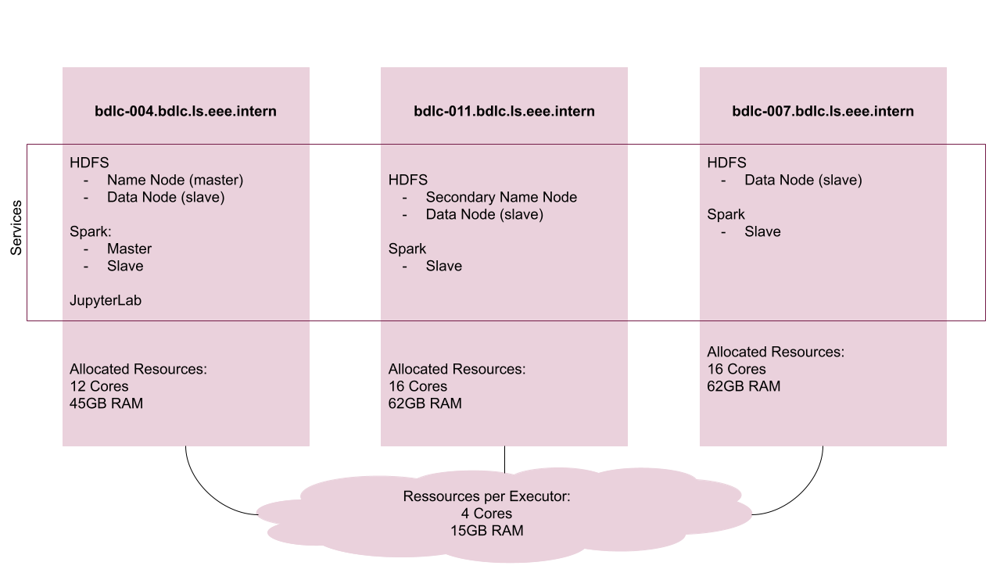

# Cluster

Die folgende Grafik zeigt die Cluster-Topologie als Bild. Es ist ersichtlich wie die Server heissen, welche Services auf welcher Maschine laufen und wie die Ressourcen aufgeteilt sind.



Die Daten, die gewählt wurden, sind nicht gross. Es handelt sich also nicht um Big Data.
Das Ziel dieses Projektes ist es jedoch zu lernen, wie mit Big Data umgegangen werden soll. Deshalb wurden die Topologie und die Frameworks und Tools so gewählt, dass sie für Big Data passend wären. Ebenfalls wurde sich für Apache Spark entschieden, da diese Technologie relevant und zeitgemäss ist.


## Probleme

Zu beginn konnten nicht zwei Spark Sessions zur gleichen Zeit laufen. Bei einem Blick auf das [Spark Cluster Master UI](http://bdlc-004.bdlc.ls.eee.intern:8080/) wurde sichtbar, dass eine Session alle verfügbaren Cores beanspruchte.

Da die verwendeten Datensets nur einige Megabyte gross sind, brauchen die Spark Applikationen
nicht so viele Ressourcen. Deshalb wurde jede Applikation auf 4 Cores limitiert, damit mehrere Applikationen zur gleichen Zeit verwendet werden können. Um die Cores zu limitieren, kann in der Spark Config `spark.cores.max` auf `4` gesetzt werden: 

```bash
su - cluster
echo "spark.cores.max 4" >> spark/conf/spark-defaults.conf
```

Wären die Daten in der Dimension von Big Data, könnte dies nicht so gelöst werden. In diesem Fall könnte wahrscheinlich jeweils nur eine Session gleichzeitg laufen und das Team müsste koordinieren, wie damit umgegangen werden soll.

## Services Überprüfen

Um sicherzustellen, dass die Services wie gewünscht funktionieren, wurde
- auf dem [Spark Cluster Master UI](http://bdlc-004.bdlc.ls.eee.intern:8080/) überprüft, dass die 3 konfigurierten Workers sichtbar sind.
- auf dem [HDFS Hadoop Overview UI](http://bdlc-004.bdlc.ls.eee.intern:9870/dfshealth.html#tab-datanode) überprüft, dass die 3 konfigurierten Nodes sichtbar sind.
- mehrere Spark Sessions gleichzeitig initiiert und auf dem [Spark Cluster Master UI](http://bdlc-004.bdlc.ls.eee.intern:8080/) überprüft, dass die Sessions unter `Applications` sichtbar sind

---
