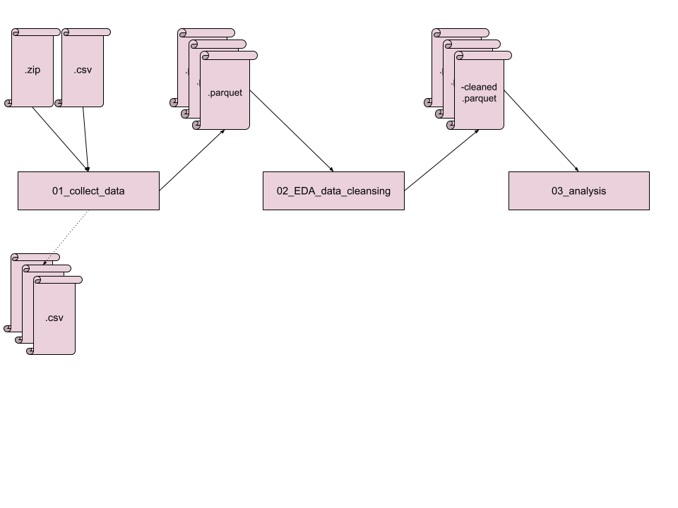
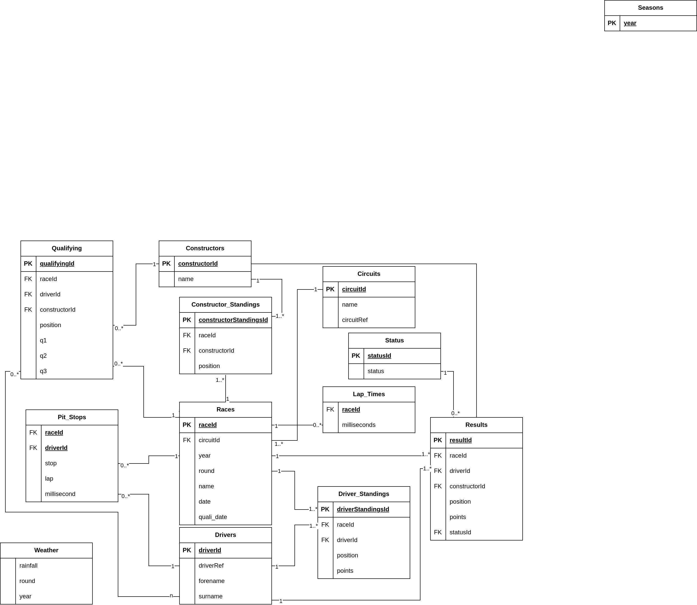

# Dataflow

Auf folgender Grafik ist der Datenfluss dargestellt.

Die Dateien werden geladen in dem Collect Data Skript. Die Formel 1 Daten werden als Zip Datei geladen und entpackt. Die CSV Dateien darin werden gespeichert.
Die Wetter Daten werden direkt als CSV Datei geladen und auf der VM gespeichert.
Alles befindet sich in dem `/f1/raw` Ordner. Es wird das HDFS benutzt als Filesystem.

Alls CSV Daten werden zu einem Parquet transformiert im Overwrite Modus, da die Daten statisch sind und werden im `/f1/data/` Ordner gespeichert.

Diese Parquet Dateien werden in dem EDA Skript geladen, einzeln untersucht und gegebenfalls angepasst.
Falls die Daten für die Analyse benötigt werden, werden sie als neue Parquet Files gespeichert mit dem 'cleaned' Suffix.
Dies geschieht ebenfalls wieder in dem Overwrite Modus und im `/f1/data/` Ordner. In einem 'real life' Projekt, würden diese Dateien versioniert und nicht einfach überschrieben werden.
Das Pre-Processing hat als Ziel, dass nur die benötigten Daten gespeichert werden müssen, die Daten wenn nötig korrigiert werden und als Parquet gespeichert werden, um Speicher zu sparen und das Laden zu beschleunigen.

Die Daten sind nun in der Form gespeichert, wie auf der folgenden Grafik dargestellt. 

_Note: Die Daten wurden nicht partitioniert gespeichert, weil nicht für jede Analyse dieselben Partitionen nötig sind. Die Daten werden jedoch in Memory partitioniert in den einzelnen Analysen, falls dies hilfreich ist._

Die 'cleaned' Parquet Dateien werden in der Analyse geladen, wo sie gebraucht werden.
